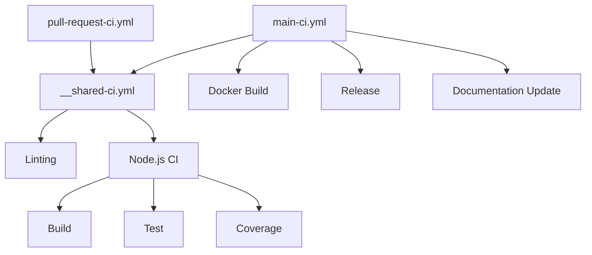

# CI/CD

Understanding CI Dokumentor's CI/CD pipeline helps you contribute effectively and debug issues. This guide covers our entire automation setup from testing to deployment.

## Overview

CI Dokumentor uses GitHub Actions for continuous integration and deployment with a multi-stage pipeline:

1. **Continuous Integration** - Code quality, testing, and validation
2. **Docker Building** - Multi-architecture container images
3. **Release Management** - Automated releases and documentation
4. **Documentation Deployment** - Automated documentation updates

## Workflow Structure

### Workflow Files

```yaml
.github/workflows/
├── __shared-ci.yml          # Reusable CI tasks
├── main-ci.yml             # Main branch CI/CD
├── pull-request-ci.yml     # PR validation
├── semantic-pull-request.yml # PR title validation
├── greetings.yml           # Welcome new contributors
├── stale.yml              # Stale issue management
└── need-fix-to-issue.yml   # Link PRs to issues
```

### Workflow Dependency Graph



## Shared CI Workflow

### Configuration

```yaml title=".github/workflows/__shared-ci.yml"
name: Common Continuous Integration tasks

on:
  workflow_call:

permissions:
  actions: read
  contents: read
  packages: read
  security-events: write
  statuses: write
  id-token: write

jobs:
  linter:
    uses: hoverkraft-tech/ci-github-common/.github/workflows/linter.yml@6857ef6d10f704e0998aa4955282f27d1b9be778 # 0.23.1
    with:
      linter-env: |
        FILTER_REGEX_EXCLUDE=dist/**/*
        VALIDATE_JSCPD=false
        VALIDATE_TYPESCRIPT_STANDARD=false
        VALIDATE_TYPESCRIPT_ES=false
        VALIDATE_TYPESCRIPT_PRETTIER=false
        VALIDATE_JAVASCRIPT_ES=false
        VALIDATE_JAVASCRIPT_STANDARD=false

  nodejs:
    uses: hoverkraft-tech/ci-github-nodejs/.github/workflows/continuous-integration.yml@51de90c148d4cc86d7c63bb9ac4fb75935d71d26 # 0.13.0
    permissions:
      id-token: write
      security-events: write
      contents: read
```

### What It Does

#### Linting Stage

- **Super-Linter** - Multi-language linting
- **ESLint** - TypeScript/JavaScript code quality
- **Prettier** - Code formatting validation
- **Markdownlint** - Documentation quality
- **YAML Lint** - Configuration file validation

#### Node.js Stage

- **Dependencies** - pnpm install with caching
- **Build** - nx build all packages
- **Test** - Comprehensive test suite with coverage
- **Security** - Dependency vulnerability scanning
- **Coverage Report** - Codecov integration

## Pull Request Workflow

### Trigger Configuration

```yaml title=".github/workflows/pull-request-ci.yml"
name: Pull request - Continuous Integration

on:
  merge_group:
  pull_request:
    branches: [main]

permissions:
  actions: read
  contents: read
  packages: read
  statuses: write
  security-events: write
  id-token: write

concurrency:
  group: ${{ github.workflow }}-${{ github.ref }}
  cancel-in-progress: true

jobs:
  ci:
    uses: ./.github/workflows/__shared-ci.yml
    secrets: inherit
```

### What Happens on PRs

1. **Trigger Conditions**:
   - Pull request opened/updated
   - Merge queue integration
   - Branch protection rules

2. **Validation Steps**:
   - Code quality checks
   - Unit and integration tests
   - Build verification
   - Security scanning
   - Documentation validation

3. **Status Checks**:
   - All checks must pass for merge
   - Failed checks block merging
   - Coverage thresholds enforced

### PR Requirements

To pass CI, your PR must:

- ✅ **Pass all linting** - No ESLint or Prettier errors
- ✅ **Pass all tests** - 100% test success rate
- ✅ **Meet coverage thresholds** - Maintain or improve coverage
- ✅ **Build successfully** - All packages compile
- ✅ **Have no security vulnerabilities** - Pass security scans
- ✅ **Follow semantic PR titles** - Use conventional commit format

## Main Branch Workflow

### Comprehensive Pipeline

```yaml title=".github/workflows/main-ci.yml"
name: Internal - Main - Continuous Integration

on:
  push:
    branches: [main]
    tags: ['*']
  workflow_dispatch:
  schedule:
    - cron: '25 8 * * 1' # Weekly scheduled run

permissions:
  actions: read
  contents: read
  packages: write
  security-events: write
  statuses: write
  id-token: write

concurrency:
  group: ${{ github.workflow }}-${{ github.ref }}
  cancel-in-progress: true

jobs:
  ci:
    uses: ./.github/workflows/__shared-ci.yml
    secrets: inherit

  docker:
    needs: ci
    uses: hoverkraft-tech/ci-github-container/.github/workflows/docker-build-images.yml@d9615e8f03feb5d9a3d96bbdd3b5617277395899 # 0.26.0
    permissions:
      contents: read
      packages: write
      id-token: write
    secrets:
      oci-registry-password: ${{ secrets.GITHUB_TOKEN }}
    with:
      images: |
        [
          {
            "name": "ci-dokumentor",
            "context": ".",
            "dockerfile": "docker/Dockerfile",
            "target": "production",
            "platforms": [
              "linux/amd64",
              "linux/arm64"
            ]
          }
        ]

  release:
    needs: ci
    if: github.event_name != 'schedule'
    runs-on: ubuntu-latest
    steps:
      - uses: actions/checkout@11bd71901bbe5b1630ceea73d27597364c9af683 # v4.2.2
      - uses: bitflight-devops/github-action-readme-generator@f750ff0ac8a4b68a3c2d622cc50a5ad20bcebaa1 # v1.8.0
        with:
          owner: ${{ github.repository_owner }}
          repo: ${{ github.event.repository.name }}

      - uses: actions/create-github-app-token@df432ceedc7162793a195dd1713ff69aefc7379e # v2.0.6
        id: generate-token
        with:
          app-id: ${{ vars.CI_BOT_APP_ID }}
          private-key: ${{ secrets.CI_BOT_APP_PRIVATE_KEY }}

      - uses: hoverkraft-tech/ci-github-common/actions/create-and-merge-pull-request@6857ef6d10f704e0998aa4955282f27d1b9be778 # 0.23.1
        with:
          github-token: ${{ steps.generate-token.outputs.token }}
          branch: docs/actions-workflows-documentation-update
          title: 'docs: update actions and workflows documentation'
          body: Update actions and workflows documentation
          commit-message: |
            docs: update actions and workflows documentation

            [skip ci]
```

### Main Branch Jobs

#### 1. CI Job

- Same as PR workflow
- Full validation pipeline
- Must pass for subsequent jobs

#### 2. Docker Job

- **Multi-architecture builds** - AMD64 and ARM64
- **Production optimization** - Minimal image size
- **Registry push** - GitHub Container Registry
- **Tag management** - Latest, version tags, and SHA tags
- **Security scanning** - Container vulnerability assessment

#### 3. Release Job

- **Readme generation** - Auto-update repository readme
- **Documentation updates** - Generate action/workflow docs
- **Automated PRs** - Create and merge documentation updates
- **GitHub App authentication** - Secure token management

## Docker Build Pipeline

### Multi-Stage Dockerfile

The Docker build uses a multi-stage approach:

```dockerfile title="docker/Dockerfile"
# Stage 1: Builder
FROM node:20-alpine AS builder
WORKDIR /app
COPY package*.json pnpm-lock.yaml ./
RUN npm install -g pnpm
RUN pnpm install --frozen-lockfile
COPY . .
RUN pnpm build

# Stage 2: Production
FROM node:20-alpine AS production
RUN addgroup -g 1001 -S ci-dokumentor && \
    adduser -S ci-dokumentor -u 1001 -G ci-dokumentor
WORKDIR /app
COPY --from=builder --chown=ci-dokumentor:ci-dokumentor /app/dist ./dist
COPY --from=builder --chown=ci-dokumentor:ci-dokumentor /app/node_modules ./node_modules
COPY --chown=ci-dokumentor:ci-dokumentor docker/ ./docker/
USER ci-dokumentor
ENTRYPOINT ["node", "dist/bin/ci-dokumentor.js"]
```

### Build Configuration

```yaml
images: |
  [
    {
      "name": "ci-dokumentor",
      "context": ".",
      "dockerfile": "docker/Dockerfile", 
      "target": "production",
      "platforms": [
        "linux/amd64",
        "linux/arm64"
      ]
    }
  ]
```

### Image Registry

Images are published to GitHub Container Registry:

- **Registry**: `ghcr.io/hoverkraft-tech/ci-dokumentor`
- **Tags**:
  - `latest` - Latest stable release
  - `main` - Latest main branch build
  - `v1.0.0` - Specific version tags
  - `sha-abcd123` - Commit SHA tags

## Release Automation

### Semantic Versioning

CI Dokumentor follows semantic versioning:

- **Major (1.0.0)** - Breaking changes
- **Minor (0.1.0)** - New features (backward compatible)
- **Patch (0.0.1)** - Bugfixes

### Automated Releases

The release process is triggered by:

1. **Manual workflow dispatch**
2. **Tag creation** (v\*)
3. **Scheduled releases** (weekly)

### Release Steps

1. **Version Detection** - Parse version from tags or package.json
2. **Changelog Generation** - Auto-generate from commit history
3. **Asset Creation** - Build and package artifacts
4. **Docker Image** - Build and tag container images
5. **Documentation** - Update documentation and readme
6. **GitHub Release** - Create release with notes and assets
7. **NPM Publish** - Publish packages to npm registry (future)

### Release Artifacts

Each release includes:

- **Source code** - Tarball and ZIP
- **Docker images** - Multi-architecture containers
- **Documentation** - Generated docs archive
- **CLI binaries** - Pre-built executables (future)

## Documentation Deployment

### Auto-Generated Documentation

The pipeline automatically maintains documentation:

#### Readme Updates

```yaml
- uses: bitflight-devops/github-action-readme-generator@f750ff0ac8a4b68a3c2d622cc50a5ad20bcebaa1
  with:
    owner: ${{ github.repository_owner }}
    repo: ${{ github.event.repository.name }}
```

This generates:

- **Action documentation** - From action.yml files
- **Workflow documentation** - From .github/workflows/\*.yml
- **API documentation** - From code comments
- **Badge updates** - CI status, coverage, version badges

#### Documentation PR Creation

```yaml
- uses: hoverkraft-tech/ci-github-common/actions/create-and-merge-pull-request@6857ef6d10f704e0998aa4955282f27d1b9be778
  with:
    github-token: ${{ steps.generate-token.outputs.token }}
    branch: docs/actions-workflows-documentation-update
    title: 'docs: update actions and workflows documentation'
    body: Update actions and workflows documentation
    commit-message: |
      docs: update actions and workflows documentation

      [skip ci]
```

### Docusaurus Deployment

Future implementation will include:

- **Docusaurus build** - Static site generation
- **GitHub Pages deployment** - Automated hosting
- **Documentation versioning** - Version-specific docs
- **Search integration** - Full-text search capability

## Security and Compliance

### Security Measures

#### Dependency Scanning

- **Dependabot** - Automated dependency updates
- **Security advisories** - GitHub security scanning
- **Vulnerability assessment** - Regular security audits
- **License compliance** - OSS license validation

#### Secret Management

- **GitHub Secrets** - Encrypted secret storage
- **GitHub Apps** - Secure authentication
- **Token rotation** - Regular credential updates
- **Least privilege** - Minimal required permissions

#### Container Security

- **Base image scanning** - Alpine Linux security updates
- **Non-root user** - Restricted container execution
- **Multi-stage builds** - Minimal attack surface
- **SBOM generation** - Software bill of materials

### Compliance

#### Code Quality Gates

- **Test coverage** - Minimum 80% coverage
- **Linting standards** - Zero-warning policy
- **Security scans** - No high/critical vulnerabilities
- **License validation** - OSS license compatibility

#### Audit Trails

- **All changes logged** - Complete Git history
- **PR reviews required** - No direct pushes to main
- **Deployment tracking** - Release and deployment logs
- **Access controls** - GitHub permissions management

## Monitoring and Alerting

### Pipeline Monitoring

#### Success Metrics

- **Build success rate** - Target: >95%
- **Test execution time** - Target: &lt;5 minutes
- **Docker build time** - Target: &lt;10 minutes
- **Coverage trends** - Maintain or improve

#### Failure Handling

- **Automatic retries** - Transient failure recovery
- **Failure notifications** - Slack/email alerts
- **Roll-back procedures** - Quick recovery processes
- **Post-mortem analysis** - Root cause identification

### Health Checks

#### Repository Health

- **Dependency freshness** - Regular updates
- **Security patches** - Timely vulnerability fixes
- **Documentation currency** - Up-to-date documentation
- **Performance benchmarks** - Regular performance testing

#### Infrastructure Health

- **Registry availability** - Container registry uptime
- **GitHub Actions quota** - Usage monitoring
- **Storage utilization** - Artifact storage management
- **Performance metrics** - Build and test performance

## Troubleshooting CI Issues

### Common Failures

#### Test Failures

```bash
# Local test reproduction
pnpm test

# Specific package testing
pnpm test --filter @ci-dokumentor/core

# Debug test failures
pnpm test -- --verbose
```

#### Build Failures

```bash
# Local build reproduction
pnpm build

# Clean and rebuild
rm -rf packages/*/dist
pnpm build

# Debug build issues
pnpm build --verbose
```

#### Docker Build Failures

```bash
# Local Docker build
docker build -f docker/Dockerfile .

# Debug Docker build
docker build --no-cache -f docker/Dockerfile .

# Multi-platform build testing
docker buildx build --platform linux/amd64,linux/arm64 -f docker/Dockerfile .
```

### Debugging Strategies

#### Workflow Debugging

1. **Enable debug logging**:

   ```yaml
   env:
     ACTIONS_RUNNER_DEBUG: true
     ACTIONS_STEP_DEBUG: true
   ```

2. **Use workflow dispatch** for testing
3. **Check job logs** for detailed output
4. **Validate permissions** and secrets

#### Local CI Simulation

```bash
# Simulate CI environment
export CI=true
export NODE_ENV=test

# Run CI commands locally
pnpm install --frozen-lockfile
pnpm build
pnpm test:ci
pnpm lint
```

### Getting Help

If you encounter CI issues:

1. **Check recent workflow runs** - Look for patterns
2. **Review job logs** - Find specific error messages
3. **Test locally** - Reproduce the issue
4. **Ask for help** - GitHub discussions or issues
5. **Check status pages** - GitHub Actions status

## Contributing to CI/CD

### Workflow Changes

When modifying workflows:

1. **Test in a fork** first
2. **Use workflow_dispatch** for testing
3. **Follow security best practices**
4. **Document changes** in PR description
5. **Get review** from maintainers

### Adding New Jobs

```yaml
new-job:
  needs: ci
  runs-on: ubuntu-latest
  permissions:
    contents: read # Minimal permissions
  steps:
    - uses: actions/checkout@v4
    - name: Your new step
      run: echo "New functionality"
```

### Security Considerations

- **Use pinned action versions** with SHA hashes
- **Minimize permissions** to required only
- **Validate inputs** and outputs
- **Avoid exposing secrets** in logs
- **Use official actions** when possible

## Related Documentation

- [Contributing Guidelines](./contributing) - How to contribute
- [Development Setup](./setup) - Local development environment
- [Testing Guide](./testing) - Testing practices and tools
- [Docker Integration](../integrations/docker) - Docker usage guide
