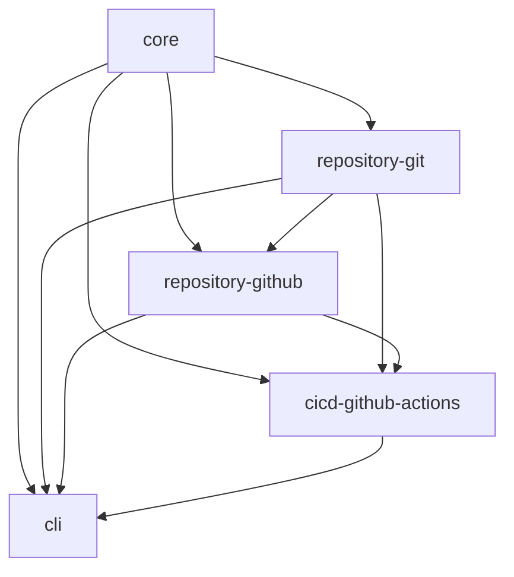

# Development Setup

This guide walks you through setting up a complete development environment for CI Dokumentor, from initial installation to running your first successful build.

## Prerequisites

### Required Software

#### Node.js 20+

CI Dokumentor requires Node.js 20 or higher for development:

```bash
# Check your current Node.js version
node --version

# Should output v20.x.x or higher
```

**Installation options:**

1. **Official installer**: [nodejs.org](https://nodejs.org/)
2. **Node Version Manager (nvm)** (recommended):

   ```bash
   # Install nvm (macOS/Linux)
   curl -o- https://raw.githubusercontent.com/nvm-sh/nvm/v0.39.0/install.sh | bash

   # Install and use Node.js 20
   nvm install 20
   nvm use 20
   ```

3. **Package managers**:

   ```bash
   # macOS with Homebrew
   brew install node@20

   # Ubuntu/Debian
   curl -fsSL https://deb.nodesource.com/setup_20.x | sudo -E bash -
   sudo apt-get install -y nodejs
   ```

#### pnpm Package Manager

CI Dokumentor uses pnpm for workspace management and dependency installation:

```bash
# Install pnpm globally
npm install -g pnpm

# Verify installation
pnpm --version
# Should output v9.0.0 or higher
```

**Why pnpm?**

- **Disk efficiency** - Shares packages across workspaces
- **Strict dependency resolution** - Prevents phantom dependencies
- **Fast installs** - Leverages hard links and content-addressing
- **Workspace support** - Excellent monorepo management

#### Git

```bash
# Verify Git installation
git --version
# Should output 2.30+ for best compatibility
```

### Optional Tools

#### Docker (Optional)

For testing containerized workflows:

```bash
# Verify Docker installation
docker --version

# Test CI Dokumentor Docker image
docker run --rm ghcr.io/hoverkraft-tech/ci-dokumentor/cli:latest --version
```

#### GitHub CLI (Optional)

For enhanced GitHub integration during development:

```bash
# Install gh CLI
# macOS: brew install gh
# Other platforms: https://cli.github.com/

# Authenticate
gh auth login
```

## Repository Setup

### 1. Clone Repository

```bash
# Clone the repository
git clone https://github.com/hoverkraft-tech/ci-dokumentor.git
cd ci-dokumentor

# Verify you're in the right place
ls -la
# Should show package.json, pnpm-workspace.yaml, etc.
```

### 2. Install Dependencies

```bash
# Install all workspace dependencies
pnpm install

# This installs dependencies for all packages in the monorepo
# Output should show packages being linked
```

### 3. Build Project

```bash
# Build all packages
pnpm build

# This builds packages in the correct dependency order
# Should complete without errors
```

### 4. Verify Installation

Run the verification steps from the canonical testing guide. For full testing and coverage commands see [testing dedicated documentation](./testing.md).

```bash
# Run tests to verify setup
pnpm test

# Check linting
pnpm lint
```

## Development Workflow

### Daily Workflow

```bash
# 1. Start of day - sync with main
git checkout main
git pull origin main

# 2. Create feature branch
git checkout -b feature/your-feature-name

# 3. Make changes and test
pnpm build
pnpm test
pnpm lint

# 4. Commit and push
git add .
git commit -m "feat: your feature description"
git push origin feature/your-feature-name
```

### Package-Specific Development

```bash
# Work on specific packages
nx build core              # Build core package
nx test cli --watch        # Test CLI in watch mode
nx lint repository-github  # Lint specific package
```

### Documentation Development

```bash
# Start documentation server
pnpm docs:start
# Opens http://localhost:3000/ci-dokumentor/

# Build documentation for production
nx build docs
```

## Workspace Structure

```
ci-dokumentor/
├── packages/
│   ├── core/                   # Core abstractions and services
│   ├── cli/                    # Command-line interface
│   ├── repository/
│   │   ├── git/               # Git repository provider
│   │   └── github/            # GitHub repository provider
│   ├── cicd/
│   │   └── github-actions/    # GitHub Actions CI/CD support
│   └── docs/                  # Documentation (Docusaurus)
├── .github/                   # GitHub workflows and templates
├── docker/                    # Docker configurations
└── README.md                  # Project readme
```

## IDE Setup

### Visual Studio Code (Recommended)

Install recommended extensions (see `.vscode/extensions.json`):

- **TypeScript** - Language support
- **ESLint** - Linting integration
- **Prettier** - Code formatting
- **Vitest** - Test runner integration
- **GitLens** - Git integration

Settings are preconfigured in `.vscode/settings.json`.

### Other IDEs

For IntelliJ IDEA, WebStorm, or other IDEs:

1. **Import as TypeScript project**
2. **Enable ESLint integration**
3. **Configure Prettier for formatting**
4. **Set up Vitest test runner**

## Environment Variables

### Optional Configuration

```bash
# GitHub token for enhanced GitHub integration
export GITHUB_TOKEN=your_personal_access_token

# Set development environment
export NODE_ENV=development
```

### Repository-Specific Settings

```bash
# For testing GitHub Actions locally
export GITHUB_REPOSITORY=owner/repo
export GITHUB_SHA=commit-sha
export GITHUB_REF=refs/heads/main
```

## Troubleshooting

### Common Setup Issues

#### Node.js Version Mismatch

```bash
# Check Node version
node --version

# If wrong version, use nvm
nvm install 20
nvm use 20
```

#### pnpm Installation Issues

```bash
# Clean pnpm cache
pnpm store prune

# Reinstall dependencies
rm -rf node_modules
rm pnpm-lock.yaml
pnpm install
```

#### Build Failures

```bash
# Clean builds
nx reset

# Rebuild from scratch
pnpm build
```

#### Permission Issues (macOS/Linux)

```bash
# Fix npm permissions
sudo chown -R $(whoami) ~/.npm
sudo chown -R $(whoami) ~/.pnpm
```

### Getting Help

- **Documentation** - Check other pages in this developer guide
- **Issues** - [GitHub Issues](https://github.com/hoverkraft-tech/ci-dokumentor/issues)
- **Discussions** - [GitHub Discussions](https://github.com/hoverkraft-tech/ci-dokumentor/discussions)

## Next Steps

After completing setup:

1. **Read the [Architecture Guide](./architecture.md)** - Understand the codebase structure
2. **Review [Testing Guide](./testing.md)** - Learn testing patterns and tools
3. **Check [Contributing Guide](./contributing.md)** - Understand contribution workflow
4. **Browse [CI/CD Guide](./ci-cd.md)** - Learn about our automation

## Quick Reference

Essential setup and build commands are listed here; for testing variations and coverage commands use, see [testing dedicated documentation](./testing.md).

```bash
# Essential commands
pnpm install           # Install dependencies
pnpm build            # Build all packages
pnpm docs:start       # Start documentation server

# Package-specific commands
nx build <package>    # Build specific package
nx test <package>     # Test specific package
nx lint <package>     # Lint specific package
```

We use pnpm for faster, more efficient package management:

```bash
# Install pnpm globally
npm install -g pnpm

# Verify installation
pnpm --version
```

#### Git

```bash
# Check if Git is installed
git --version

# Install Git if needed
# macOS: git comes with Xcode Command Line Tools
xcode-select --install

# Ubuntu/Debian
sudo apt update && sudo apt install git

# Windows: Download from https://git-scm.com/
```

#### Docker (Optional)

For testing Docker integration and running containerized workflows:

```bash
# Install Docker Desktop
# macOS/Windows: https://www.docker.com/products/docker-desktop
# Linux: Follow distribution-specific instructions

# Verify installation
docker --version
```

## Repository Setup

### 1. Fork and Clone

#### Fork the Repository

1. Visit [hoverkraft-tech/ci-dokumentor](https://github.com/hoverkraft-tech/ci-dokumentor)
2. Click the "Fork" button in the top-right corner
3. Wait for the fork to complete

#### Clone Your Fork

```bash
# Clone your fork
git clone https://github.com/YOUR_USERNAME/ci-dokumentor.git
cd ci-dokumentor

# Add upstream remote for staying in sync
git remote add upstream https://github.com/hoverkraft-tech/ci-dokumentor.git

# Verify remotes
git remote -v
# Should show:
# origin    https://github.com/YOUR_USERNAME/ci-dokumentor.git (fetch)
# origin    https://github.com/YOUR_USERNAME/ci-dokumentor.git (push)
# upstream  https://github.com/hoverkraft-tech/ci-dokumentor.git (fetch)
# upstream  https://github.com/hoverkraft-tech/ci-dokumentor.git (push)
```

### 2. Install Dependencies

```bash
# Install all dependencies for the monorepo
pnpm install

# This will install dependencies for:
# - Root workspace
# - All packages in packages/
# - Development tools and utilities
```

Expected output:

```text
Scope: all 6 workspace projects
Lockfile is up to date, resolution step is skipped
Progress: resolved 659, reused 659, downloaded 0, added 659, done
```

### 3. Initial Build

```bash
# Build all packages
pnpm build

# This builds packages in dependency order:
# 1. @ci-dokumentor/core
# 2. @ci-dokumentor/repository-git
# 3. @ci-dokumentor/repository-github
# 4. @ci-dokumentor/cicd-github-actions
# 5. @ci-dokumentor/cli
```

Expected output:

```text
NX   Running target build for 5 projects:
- @ci-dokumentor/cicd-github-actions
- @ci-dokumentor/repository-github
- @ci-dokumentor/repository-git
- @ci-dokumentor/core
- @ci-dokumentor/cli

✅ Successfully ran target build for 5 projects
```

### 4. Verify Installation

```bash
# Run tests to ensure everything works
pnpm test

# Run linting
pnpm lint

# Check CLI functionality (development)
# Option A: build and run the packaged CLI directly
cd packages/cli
pnpm build
node dist/bin/ci-dokumentor.js --help

# Option B: create a global symlink for local development (pnpm workspace-aware)
# This mirrors `npm link` behavior but uses pnpm. Requires pnpm installed globally.
pnpm link --global
ci-dokumentor --help
```

## Development Environment

### Workspace Structure

```text
ci-dokumentor/
├── .github/                 # GitHub workflows and templates
├── packages/docs/          # Architecture documentation
├── docker/                 # Docker configuration
├── packages/               # Monorepo packages
│   ├── core/              # Core abstractions
│   ├── cli/               # Command-line interface
│   ├── repository/        # Repository providers
│   │   ├── git/          # Git provider
│   │   └── github/       # GitHub provider
│   └── cicd/             # CI/CD platform support
│       └── github-actions/ # GitHub Actions support
├── website/               # Docusaurus documentation site
├── package.json           # Root package.json
├── pnpm-workspace.yaml    # pnpm workspace configuration
├── nx.json               # NX workspace configuration
└── tsconfig.base.json    # Base TypeScript configuration
```

### Package Dependencies

Understanding the dependency graph:



This means:

- **Core** has no dependencies (pure domain logic)
- **Repository packages** depend on core
- **CI/CD packages** depend on core and repository packages
- **CLI** depends on all other packages

### IDE Configuration

#### Visual Studio Code

The repository includes Visual Studio Code configuration in `.vscode/`:

#### Install Recommended Extensions

### Environment Variables

Create a `.env` file in the root directory for development:

```bash title=".env"
# GitHub token for enhanced repository information (optional)
GITHUB_TOKEN=ghp_your_token_here

# Docker settings (if using Docker)
DOCKER_BUILDKIT=1
COMPOSE_DOCKER_CLI_BUILD=1
```

**Note**: Never commit the `.env` file! It's already in `.gitignore`.

### Git Configuration

#### Configure Git for the project

```bash
# Set your Git identity (if not already done globally)
git config user.name "Your Name"
git config user.email "your.email@example.com"

# Optional: Use different identity for this project
git config --local user.name "Your Name"
git config --local user.email "your.email@example.com"
```

## Development Workflow

### Day-to-Day Development

#### 1. Start Development Session

```bash
# Switch to main branch and get latest changes
git checkout main
git pull upstream main

# Create a new feature branch
git checkout -b feature/your-feature-name

# Install any new dependencies (if package.json changed)
pnpm install

# Build packages
pnpm build
```

#### 2. Development Loop

```bash
# Make your changes...

# Build affected packages
pnpm build

# Run tests for affected packages
pnpm test

# Run linting
pnpm lint --fix

# Test CLI functionality
cd packages/cli
pnpm link --global
ci-dokumentor --help
```

#### 3. Testing Changes

```bash
# Test your changes with a real action.yml file
cd /path/to/test/project
ci-dokumentor generate --source action.yml

# Test with Docker
make docker-build

cd /path/to/test/project
docker run --rm -v $(pwd):/workspace -u $(id -u):$(id -g) ci-dokumentor:latest generate --source /workspace/action.yml
```

### Working with NX

CI Dokumentor uses NX for monorepo management:

```bash
# Build specific package
nx build core
nx build cli

# Test specific package
nx test core
nx test cli

# Lint specific package
nx lint core

# Run command for all packages
nx run-many --target=build --all
nx run-many --target=test --all

# See dependency graph
nx graph
```

### Package-Specific Development

#### Core Package

```bash
cd packages/core

# Run tests in watch mode
npm run test -- --watch

# Build and watch for changes
npm run build -- --watch
```

#### CLI Package

```bash
cd packages/cli

# Link for global usage (pnpm workspace-aware)
pnpm link --global

# Test CLI commands
ci-dokumentor --help
ci-dokumentor generate --source action.yml

# Debug CLI
node --inspect-brk dist/bin/ci-dokumentor.js generate --source action.yml
```

#### Repository Packages

```bash
cd packages/repository/github

# Run tests in watch mode
npm run test -- --watch

# Build and watch for changes
npm run build -- --watch
```

## Debugging

### CLI Debugging

#### Node.js Debugger

```bash
# Debug CLI with Node.js inspector
cd packages/cli
node --inspect-brk dist/bin/ci-dokumentor.js generate --source action.yml

# Open Chrome DevTools: chrome://inspect
```

#### Visual Studio Code Debugging

Create `.vscode/launch.json`:

```json
{
  "version": "0.2.0",
  "configurations": [
    {
      "name": "Debug CLI",
      "type": "node",
      "request": "launch",
      "program": "${workspaceFolder}/packages/cli/dist/bin/ci-dokumentor.js",
      "args": ["generate", "--source", "action.yml"],
      "cwd": "${workspaceFolder}/test-data",
      "console": "integratedTerminal",
      "skipFiles": ["<node_internals>/**"]
    }
  ]
}
```

### Test Debugging

```bash
# Debug specific test
cd packages/core
pnpm test -- --grep "specific test name" --inspect-brk

# Run single test file (from package root)
pnpm test -- packages/core/src/specific-test.spec.ts
```

### Docker Debugging

```bash
# Build and run Docker container with shell access
make docker-shell

# Inside container:
# node /app/dist/bin/ci-dokumentor.js --help
```

## Troubleshooting

### Common Issues

#### Node.js Version Issues

**Problem**: Build fails with Node.js version errors

**Solution**:

```bash
# Check Node.js version
node --version

# Use nvm to switch versions
nvm install 20
nvm use 20

# Reinstall dependencies
rm -rf node_modules pnpm-lock.yaml
pnpm install
```

#### TypeScript Compilation Errors

**Problem**: TypeScript errors in IDE or build

**Solution**:

```bash

# Clean NX cache
pnpm nx reset

# Clean TypeScript cache
rm -rf packages/*/dist
rm -rf packages/*/.tsbuildinfo

# Rebuild all packages
pnpm build

# Restart TypeScript server in Visual Studio Code
# Cmd/Ctrl + Shift + P -> "TypeScript: Restart TS Server"
```

#### pnpm Installation Issues

**Problem**: pnpm install fails or is slow

**Solution**:

```bash
# Clear pnpm cache
pnpm store prune

# Delete lock file and reinstall
rm pnpm-lock.yaml
pnpm install

# Use different registry if needed
pnpm install --registry https://registry.npmjs.org/
```

#### Git Permission Issues

**Problem**: Cannot push to repository

**Solution**:

```bash
# Check remote URLs
git remote -v

# Make sure you're pushing to your fork
git remote set-url origin https://github.com/YOUR_USERNAME/ci-dokumentor.git

# Or use SSH
git remote set-url origin git@github.com:YOUR_USERNAME/ci-dokumentor.git
```

#### Docker Issues

**Problem**: Docker build fails

**Solution**:

```bash
# Check Docker is running
docker info

# Build with no cache
docker build --no-cache -f docker/Dockerfile .

# Check Docker permissions (Linux)
sudo usermod -aG docker $USER
# Log out and back in
```

### Performance Issues

#### Slow Builds

```bash
# Use NX caching
export NX_CACHE_DIRECTORY=.nx/cache

# Build only affected packages
nx affected:build

# Use parallel builds
nx run-many --target=build --all --parallel
```

#### Slow Tests

```bash
# Run tests in parallel
nx run-many --target=test --all --parallel

# Run only affected tests
nx affected:test

# Use test caching
nx run-many --target=test --all --parallel --cache
```

### Getting Help

If you encounter issues not covered here:

1. **Check existing issues** - [GitHub Issues](https://github.com/hoverkraft-tech/ci-dokumentor/issues)
2. **Ask questions** - [GitHub Discussions](https://github.com/hoverkraft-tech/ci-dokumentor/discussions)
3. **Join the community** - Discord (coming soon)

## Next Steps

Now that your development environment is set up:

1. **Explore the codebase** - Start with `packages/core/src/`
2. **Run the examples** - Try generating documentation for real projects
3. **Read the architecture docs** - Understand the design patterns
4. **Pick an issue** - Find "good first issue" labels on GitHub
5. **Write tests** - Add tests for any changes you make

Happy coding! 🚀

## Related Guides

- [Contributing Guidelines](./contributing) - How to contribute effectively
- [Testing Guide](./testing) - Comprehensive testing information
- [CI/CD Guide](./ci-cd) - Understanding our build pipeline
- [Architecture Documentation](./architecture) - System design
